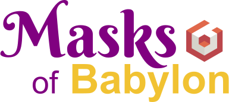

# Masks of Babylon

Final project for the Interactive Graphics course held by Prof. Marco Schaerf.

A simplified turn-based RPG with animations, light effects, and a dungeon to explore.

## This is the original version submitted for the exam...

**...but some elements are not displayed correctly on newer versions of the major browsers.**

If **walls and/or floors appear flat**, play the updated version [HERE](https://github.com/torchipeppo/masks-of-babylon).

## Play the game

Check out the [GitHub Page](https://sapienzainteractivegraphicscourse.github.io/final-project-masks-of-babylon/)!

*\* If the main menu does not fit the screen, use the zoom out feature of your browser.*

## Project report

See the [report.pdf](https://github.com/SapienzaInteractiveGraphicsCourse/final-project-masks-of-babylon/blob/main/report.pdf) file.

## Libraries used

- [Babylon.js](https://www.babylonjs.com/)

## Authors

In alphabetical order:
- [Giovanni Pecorelli](https://github.com/GioPec) [1799865]
- [Francesco Petri](https://github.com/torchipeppo) [1797147]
- [Jacopo Rossi](https://github.com/JacopoRossi) [1801667]
- [Giacomo Venneri](https://github.com/GiacomoVenneri) [1810169] *(Not in the Classroom group because of a system error)*
